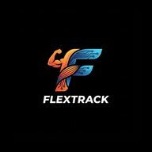

# FlexTrack Fitness App

FlexTrack is a modern, mobile-first Progressive Web Application (PWA) built for serious lifters who want a frictionless workout tracking experience. It combines the speed of a local-first app with the reliability of cloud sync, ensuring you never lose your progress even if you lose your connection.



## 🚀 Key Features

### 🏋️‍♂️ Smart Workout Tracking
*   **Intelligent Autofill**: The app remembers the weight and reps you lifted last time for every exercise, so you only need to log your progress.
*   **Crash Protection**: Your active session is saved to local storage after every interaction. Close the app, refresh the page, or lock your phone—your workout will be exactly where you left it.
*   **Drop Sets & Warmups**: Native support for tracking special set types like Drop Sets (highlighted in purple) and Warmup sets (highlighted in orange).
*   **Optimized Inputs**: Smart number inputs that handle typing naturally (no more fighting with leading zeros).

### 🛠 Flexible Routines
*   **Custom Workouts**: Create unlimited custom workout routines.
*   **Drag-and-Drop Ordering**: Easily reorder exercises within your routines to match your gym flow.
*   **Editing Safety**: Prevents accidental edits to routines while a session is active to ensure data integrity.

### 📊 Comprehensive History & Analytics
*   **Snapshot History**: Every completed session saves a snapshot of the workout at that moment. Even if you later change or delete the original routine, your history remains accurate.
*   **Detailed Stats**: Visualize your progress with charts for volume, weight trends, and consistency.
*   **Calendar View**: Browse past workouts by date and see detailed breakdowns of every set.

### 📱 Progressive Web App (PWA)
*   **Installable**: Add FlexTrack to your home screen on Android or iOS for a native app experience.
*   **Offline Capable**: The "Cache-First" architecture allows the app to load instantly and function even with poor or no internet connection. Background sync keeps your data safe in the cloud (Supabase) when you reconnect.

## 🛠 Tech Stack

*   **Frontend**: React 19, TypeScript, Vite
*   **Styling**: Tailwind CSS (Dark Mode optimized)
*   **State**: React Context + Local Storage (Hybrid Sync)
*   **Backend**: Supabase (PostgreSQL + Auth)
*   **Testing**: Vitest + React Testing Library

## 🏁 Getting Started

### Prerequisites
*   Node.js (v18 or higher)
*   npm or yarn

### Installation

1.  Clone the repository:
    ```bash
    git clone https://github.com/yourusername/flextrack-pwa.git
    cd flextrack-pwa
    ```

2.  Install dependencies:
    ```bash
    npm install
    ```

3.  Set up Environment Variables:
    Create a `.env` file in the root directory and add your Supabase credentials:
    ```env
    VITE_SUPABASE_URL=your_supabase_url
    VITE_SUPABASE_ANON_KEY=your_supabase_anon_key
    ```

4.  Run the development server:
    ```bash
    npm run dev
    ```

5.  Open `http://localhost:3000` in your browser.

## 🐳 Running with Docker

You can also run the app in a container:

```bash
docker build -t vibe-fitness .
docker run -p 8080:8080 vibe-fitness
```

## 🧪 Testing

Run the test suite to ensure everything is working correctly:

```bash
npm test
```

## 🤝 Contributing

Contributions are welcome! Please feel free to submit a Pull Request.

1.  Fork the project
2.  Create your feature branch (`git checkout -b feature/AmazingFeature`)
3.  Commit your changes (`git commit -m 'Add some AmazingFeature'`)
4.  Push to the branch (`git push origin feature/AmazingFeature`)
5.  Open a Pull Request

## 📄 License

This project is licensed under the MIT License.
